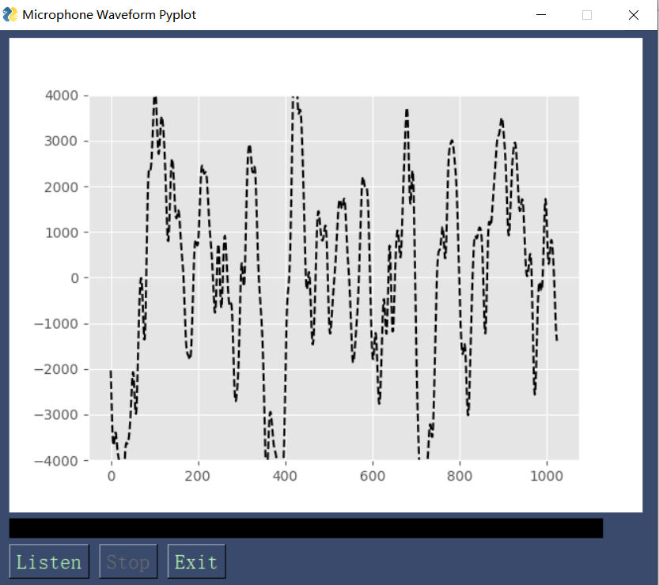

# secstore

sectore.py是完成麦克风录音，扬声器播音，python提供GUI绘制声音波形图的源代码

# secstore

sectore.py是完成麦克风录音，扬声器播音，python提供GUI绘制声音波形图的源代码。
详细的代码讲解和思路过程可以在[参考博客](https://medium.com/geekculture/real-time-audio-wave-visualization-in-python-b1c5b96e2d39)中找到，有非常完整的思考学习过程

你也可以在 [Secstore](https://github.com/THE-FOOL-rookie/Secstore) 中找到源码和说明文档.注意为上两个链接都需要科学上网哦（翻墙）。

- [secstore](#secstore)
- [secstore](#secstore-1)
  - [environment](#environment)
  - [Usage](#usage)

## environment
Hardware
* PC's, Desktop, Laptops
* Raspberry Pi
  
OS
* Windows 7, 8, 10，11
* Linux on PC - Tested on several distributions
* Raspberry Pi OS

secstore has the following dependencies:
* Python 3
* [NumPy](https://pypi.org/project/numpy/)
* [matplotlib](matplotlib) 
* [PySimpleGUI](https://pysimplegui.readthedocs.io/en/latest/) 
* [pyaudio](https://pypi.org/project/PyAudio/) 

## Usage
下载py源码，运行.py文件就能打开UI界面。

按下Listen就会开始打开麦克风录音、绘制声音波形图并调用音箱播放麦克风收集到的声音。

按下Stop暂停录制、播放，显示暂停时的波形

按下Exit退出UI界面

